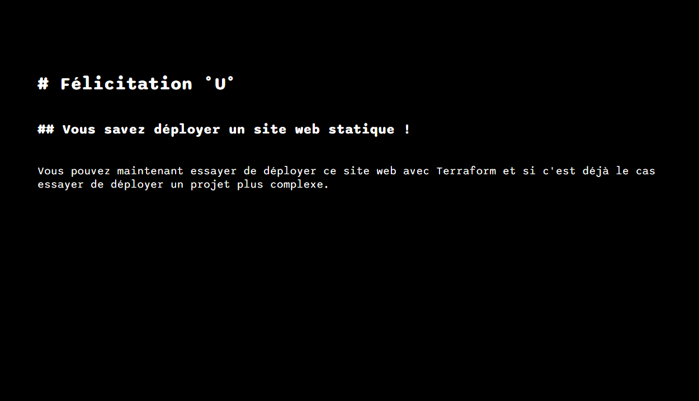

# FYC Exercice 1 - Deployer un site web statique

## Contexte

Pour pouvoir commencer à se faire la main sur Terraform et à voir la différence entre la console AWS et l'infrastructure as code, il vous est fourni un site web statique simple qu'il vous faudra déployer.

## Votre Mission

1. Récupérer les fichiers présents dans le dossier "src" (pour pouvoir faire fonctionner le site web comme attendu, il est important de ne pas renommer les fichiers et de les garder groupés dans un même dossier)
2. Avec la console AWS
   - Créez un S3
   - Ajoutez-y tout le dossier "src"
   - Activez le "Static website hosting"
3. Avec Terraform
   - Créez un S3
   - Ajoutez-y tout le dossier "src"
   - Activez le "Static website hosting"

Si les deux sites statiques déployés sont conforment aux images dans résultat attendu alors félicitations, vous savez maintenant déployer un site statique avec AWS et Terraform n'oubliez pas de supprimer les ressources créer durant cet exercice pour éviter tout surcoût de la part d'AWS

## Résultat attendu 

